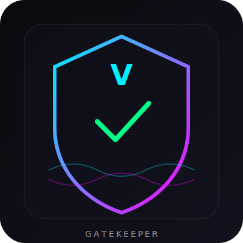
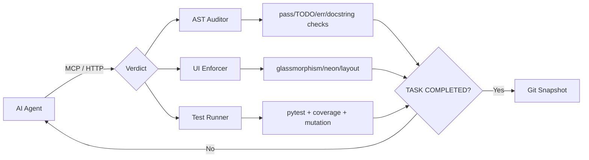

<div align="center">
  
  <h1 align="center" style="font-size: 48px; font-weight: 700; letter-spacing: 4px; background: linear-gradient(135deg, #00f0ff, #ff00ff); -webkit-background-clip: text; -webkit-text-fill-color: transparent; margin: 10px 0 0 0;">VERDICT</h1>
  <p align="center"><strong>The Unbypassable Code Quality Gatekeeper for AI Agents</strong></p>

  [](https://github.com/Zubair-z/VERDICT-MCP/actions)
  [](https://opensource.org/licenses/MIT)
  [](https://www.python.org/downloads/)
  [](https://modelcontextprotocol.io)
  [](https://fastapi.tiangolo.com)
  [](https://docker.com)
  [](https://github.com/Zubair-z/VERDICT-MCP)
  [](https://github.com/Zubair-z/VERDICT-MCP/stargazers)

  <hr style="border: 1px solid rgba(255,255,255,0.06); width: 80%;">
</div>

<br>

<p align="center">
  <b>English</b> · 
  <a href="#features">Features</a> · 
  <a href="#quick-start">Quick Start</a> · 
  <a href="#the-problem">The Problem</a> · 
  <a href="#architecture">Architecture</a> ·
  <a href="#api-endpoints">API</a> ·
  <a href="#multi-language-support">Multi-Lang</a>
</p>

<br>

---

## The Problem

AI agents suffer from **Context Drift**, **Illusion of Completion**, and **Quality Degradation**:

```
❌ Mark tasks DONE but leave empty pass statements
❌ Skip critical error handling
❌ Generate unstyled "developer art" UIs  
❌ Write superficial tests with no real assertions
❌ No accountability — human must review everything manually
```

## The Solution

**Verdict** is a programmatic gatekeeper that sits between the AI agent and your codebase. Every task must pass **all three gates** before being marked complete:

<p align="center">
  <code style="background: #1a1a2e; padding: 4px 12px; border-radius: 6px;">Agent Writes Code</code>
  <span style="color: #00f0ff; font-size: 20px;"> → </span>
  <code style="background: #1a1a2e; padding: 4px 12px; border-radius: 6px; border-left: 3px solid #00f0ff;">AST Audit</code>
  <span style="color: #00f0ff; font-size: 20px;"> → </span>
  <code style="background: #1a1a2e; padding: 4px 12px; border-radius: 6px; border-left: 3px solid #ff00ff;">UI Validation</code>
  <span style="color: #00f0ff; font-size: 20px;"> → </span>
  <code style="background: #1a1a2e; padding: 4px 12px; border-radius: 6px; border-left: 3px solid #00ff88;">95% Coverage + 80% Mutation</code>
  <span style="color: #00f0ff; font-size: 20px;"> → </span>
  <code style="background: #00ff88; color: #0a0a0f; padding: 4px 12px; border-radius: 6px; font-weight: bold;">✅ COMPLETED</code>
</p>

---

## Features

<table>
  <tr>
    <td align="center" width="25%">
      <h3>🔬 AST Audit</h3>
      <sub>Detects `pass`, `# TODO`, missing try-except, missing docstrings</sub>
    </td>
    <td align="center" width="25%">
      <h3>🎨 UI Dictatorship</h3>
      <sub>Enforces glassmorphism, neon accents, custom stylesheets — rejects defaults</sub>
    </td>
    <td align="center" width="25%">
      <h3>🧪 Mutation Testing</h3>
      <sub>80%+ mutation score required — tests must catch injected bugs</sub>
    </td>
    <td align="center" width="25%">
      <h3>📊 95% Coverage</h3>
      <sub>Strict line coverage gate — no untested code allowed</sub>
    </td>
  </tr>
  <tr>
    <td align="center">
      <h3>🌐 Multi-Language</h3>
      <sub>JS, TS, Go, Rust, Java, Kotlin, React — not just Python</sub>
    </td>
    <td align="center">
      <h3>🔄 REST API</h3>
      <sub>Any agent can call Verdict via HTTP — no MCP required</sub>
    </td>
    <td align="center">
      <h3>🐳 Docker Ready</h3>
      <sub>One command: <code>docker-compose up</code></sub>
    </td>
    <td align="center">
      <h3>⚡ VS Code Ext</h3>
      <sub>Ctrl+Shift+V to audit right from your editor</sub>
    </td>
  </tr>
  <tr>
    <td align="center">
      <h3>🔗 GitHub Actions</h3>
      <sub>Zero-config CI/CD — runs on every push and PR</sub>
    </td>
    <td align="center">
      <h3>📸 Git Snapshots</h3>
      <sub>Auto-rollback on test failure — never lose working code</sub>
    </td>
    <td align="center">
      <h3>🧩 Dependency DAG</h3>
      <sub>Tasks can't start until dependencies are complete</sub>
    </td>
    <td align="center">
      <h3>📜 Plan Integrity</h3>
      <sub>SHA-256 hash chain prevents plan tampering</sub>
    </td>
  </tr>
</table>

---

## Quick Start

### 1. Install

```bash
pip install verdict-mcp
# OR from source:
git clone https://github.com/Zubair-z/VERDICT-MCP.git
cd VERDICT-MCP
pip install -r requirements.txt
```

### 2. Scaffold a project

```bash
verdict init myproject
cd myproject
```

This creates: `plan.md` + `auth_handler.py` + `db_handler.py` + `tests/test_auth_handler.py`

### 3. Run as MCP Server (for AI agents)

```bash
python -m verdict_mcp
```

### 4. Run as REST API (for any HTTP client)

```bash
python -m verdict_mcp.api_server
# → http://localhost:8000
curl http://localhost:8000/health
```

### 5. Run full validation pipeline

```bash
curl -X POST http://localhost:8000/pipeline/run \
  -H "Content-Type: application/json" \
  -d '{
    "task_id": "TASK_001",
    "source_files": ["auth_handler.py"],
    "test_file": "tests/test_auth_handler.py",
    "target_file": "auth_handler.py",
    "ui_file": "main_window.py"
  }'
```

---

## Architecture



---

## API Endpoints

| Method | Path | Description |
|--------|------|-------------|
| `GET` | `/health` | Server health |
| `POST` | `/plan/init` | Initialize plan |
| `GET` | `/plan/summary` | Get task states |
| `GET` | `/plan/task/{id}` | Task details |
| `POST` | `/audit` | AST audit files |
| `GET` | `/ui/style-guide` | Design tokens |
| `POST` | `/ui/validate` | Validate UI |
| `POST` | `/tests/run` | Coverage + mutation |
| `GET` | `/coverage` | Coverage report |
| `POST` | `/pipeline/run` | Full lifecycle |

---

## Multi-Language Support

| Language | Extensions | Checks Applied |
|----------|-----------|----------------|
| Python | `.py` | Full AST audit (pass, TODO, try-except, docstrings) |
| JavaScript | `.js` | TODO, empty functions, missing try-catch |
| TypeScript | `.ts` | TODO, empty functions, missing try-catch |
| React | `.jsx`, `.tsx` | TODO, empty components, missing error handling |
| Go | `.go` | TODO, empty funcs, missing error handling |
| Rust | `.rs` | TODO, empty fn, missing error handling |
| Java | `.java` | TODO, empty methods, missing try-catch |
| Kotlin | `.kt` | TODO, empty fun, missing error handling |

---

## CLI Commands

```bash
# Scaffold a new project
verdict init myproject

# Run Verdict checks on current project
verdict verify

# Start MCP server
python -m verdict_mcp

# Start REST API
python -m verdict_mcp.api_server

# Run tests locally
python -m pytest tests/ -v --cov=verdict_mcp --cov-report=term-missing
```

---

## Docker

```bash
# Start REST API
docker-compose up verdict-mcp

# Start MCP stdio mode
docker-compose up verdict-mcp-stdio
```

---

## VS Code Extension

1. Copy `.vscode-extension/` folder to `~/.vscode/extensions/verdict-mcp/`
2. Restart VS Code
3. Open a Python file → press `Ctrl+Shift+V`
4. Or enable auto-audit on save in settings

---

## Contributing

We welcome contributions! See [CONTRIBUTING.md](CONTRIBUTING.md) for guidelines.

<p align="center">
  <a href="https://github.com/Zubair-z/VERDICT-MCP/issues">🐛 Report Bug</a> ·
  <a href="https://github.com/Zubair-z/VERDICT-MCP/issues">✨ Request Feature</a> ·
  <a href="CONTRIBUTING.md">🧑‍💻 Contribute</a>
</p>

---

<div align="center">
  <sub>Built with ❄️ by the Verdict Team</sub>
  <br>
  <sub>MIT License · Copyright 2026</sub>
  <br><br>
  <a href="https://github.com/Zubair-z/VERDICT-MCP">
    
  </a>
</div>
